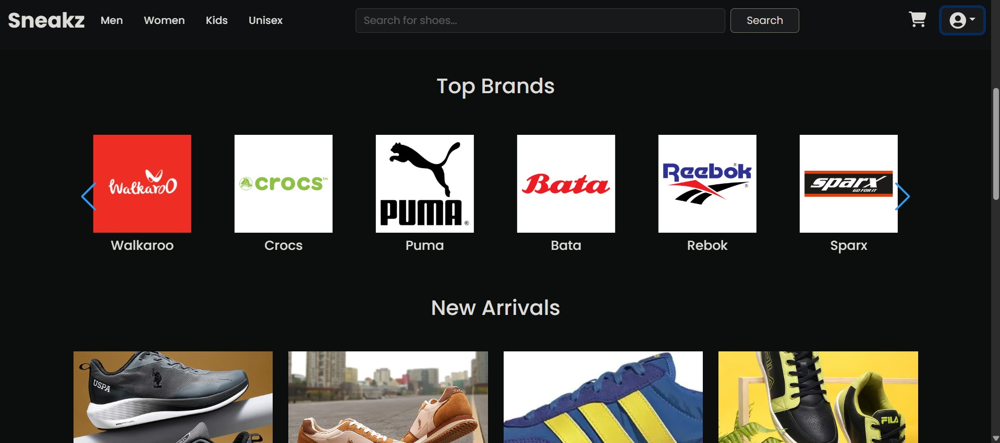
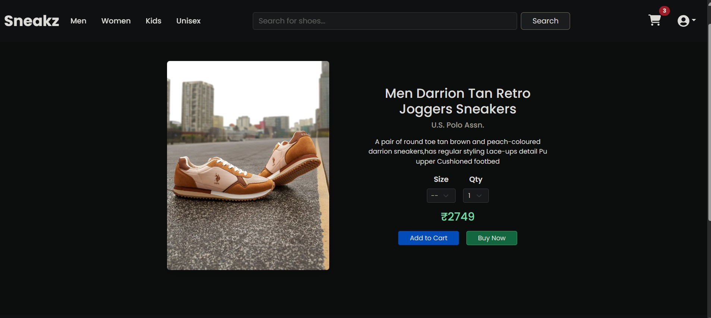
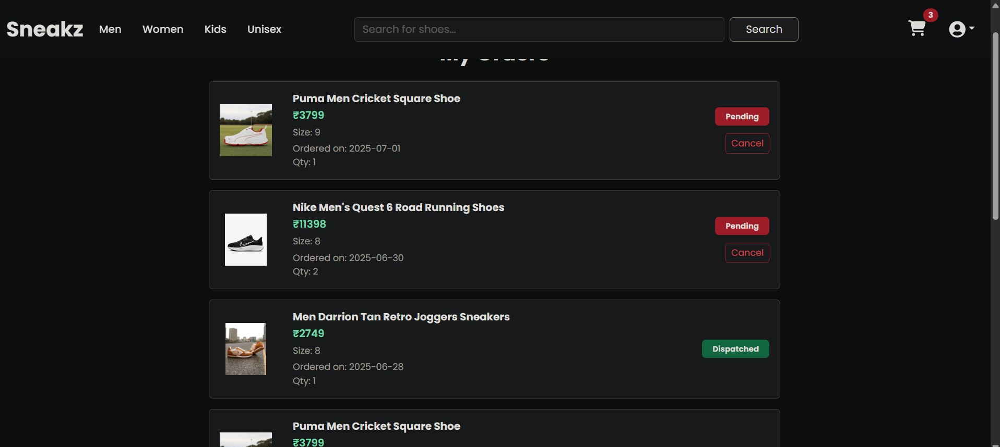
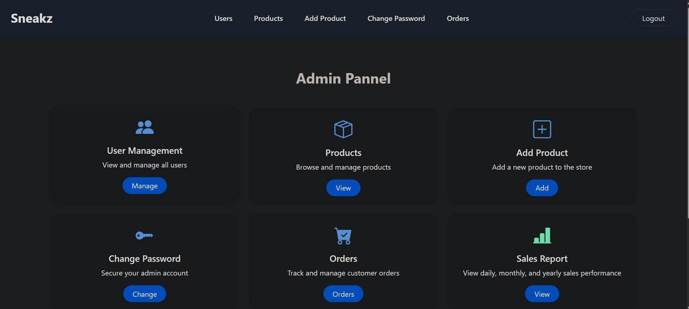

# 👟 Footwear E-commerce Site

A full-stack e-commerce web application for selling footwear online. Built with React for the frontend and Spring Boot for the backend. Includes secure user authentication, product listings, search, cart, order history, and admin controls.

---

## 📌 Features

### 👤 User Features
- Sign up, login, and change password
- Browse products by category and brand
- Add/remove products from cart
- Place orders and view order history
- Edit user profile

### 🛠️ Admin Features
- Add/edit/ products
- View product list
- Hide products from homepage (status = Hidden)
- Analyze sales report
- Update order status

---

## 🧱 Tech Stack

| Layer       | Technology                         |
|-------------|-------------------------------------|
| Frontend    | React, React Router, Axios, Bootstrap |
| Backend     | Spring Boot, Spring Security, JPA, Hibernate |
| Database    | MySQL                              |
| Auth        | JWT (JSON Web Token)               |
| Tooling     | Git, VS Code, IntelliJ, Postman     |

---

## 🔐 Authentication & Authorization

- **JWT-based security** for login sessions
- Role-based access control (user/admin)
- Protected routes in both frontend and backend

---

## 📂 Project Structure

```

Footwear_Ecom_Site/
├── frontend/ # React frontend
│ ├── public/
│ └── src/
├── backend/ # Spring Boot backend
│ ├── src/
│ └── application.properties (not committed)

```

---

## 📸 Screenshots

### 🏠 Homepage


### 🏠 Homepage



### 🛍️ Product Details


### 🛒 Cart


### 📦 Order History


### 🛠️ Admin Panel


---

## ✍️ Author
Abin S  
[GitHub](https://github.com/AbinS2003) | [LinkedIn](https://www.linkedin.com/in/abin-s-8912a1301/)


